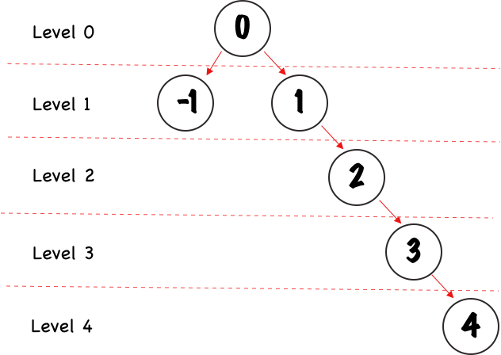

# Iteratively Traverse a Binary Search Tree, Breadth-First

## Introduction

Traversing a binary search tree can be done with recursion, but what about an iterative approach? In this solution, we implement a way to traverse a sorted binary search tree using iteration.

Things to note: the BST (binary search tree) is implemented using a sorting algorithm, though that makes no difference in the way we traverse the tree. Also, for now, this tree implementation only allows number values passed in as data to the BST's nodes.

## Solution

First, let's discuss some properties of a sorted binary tree:

1. The tree has 1 root node.

2. Each node has a `data` property, which contains the number value for that node, and `left` and `right` properties, which represent the children for that node.

3. Children whose values are less than the current node's value are stored in the `left` property, while children whose values are greater than the current node's value are stored in the `right` property.

4. Each node can have UP TO 2 children.

Using the breadth-first approach to traversal, as opposed to depth-first, we print out the value of each node in order of their level. Let's take a look at what that means:

## Performance

For performance, the runtime complexity of this solution is linear, or O(n). This is because the time it takes to iterate through the queue depends directly on the size of the tree's nodes.

For memory, the space complexity is also linear, or O(n). 

There is a possibility that, in the best-case, the space complexity can be constant, or O(1), because a binary search tree can have **UP TO** 2 children nodes per parent node, but it is possible to only have 1 child per parent. If this were the case, then we would be removing 1 node into the queue at the same time we are inserting another one, meaning the *NET* space complexity would not grow as we iterate through the queue, and it would remain constant.

However, in the worst-case, all nodes would have 2 child nodes, and the space complexity would therefore be O(n). Because of this, we take the worst-case scenario and say that space complexity is really linear, or O(n).

## Setup

No setup is required.

## Running the Code

The `runner.js` file has been provided for the user to easily run the code and test the implementation. Simply copy and paste the contents of the entire file and paste it into a browser developer tools console tab, or, my personal favorite, using a REPL, like repl.it, found here: https://repl.it/languages/nodejs.

## Future Considerations

Some things to consider in the future in order to improve this solution:

1. Currently, the solution only accepts number values as data to the nodes. It would be good to open this up to other data types, such as strings, so that it can be more useful.

2. Speaking of usability, it is worth considering adding functionality to the code that will print the level at which each data point is being read. Currently, the data points are printed on the screen in a new line, but I think it would be helpful for a user to see at which level each data point is being printed. A breadth-first traversal is especially useful to the user if we have this data! For example, what if a user wanted to use this type of traversal to pull all of the employees of an organization of a certain level (for example, all C-level executives, or managers)? Currently, there is no way for the user to get that sort of granularity.

3. Of course, writing unit tests would improve the codebase and make sure there is appropriate code coverage to prevent future bugs.